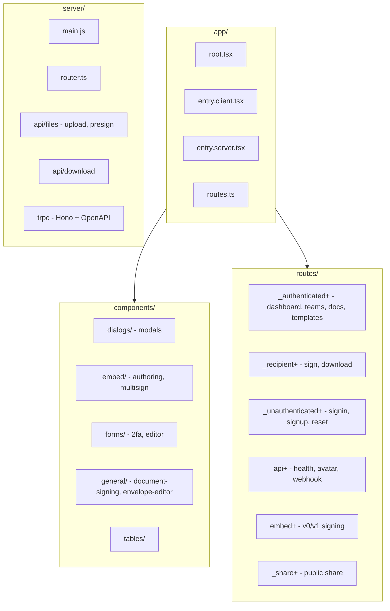
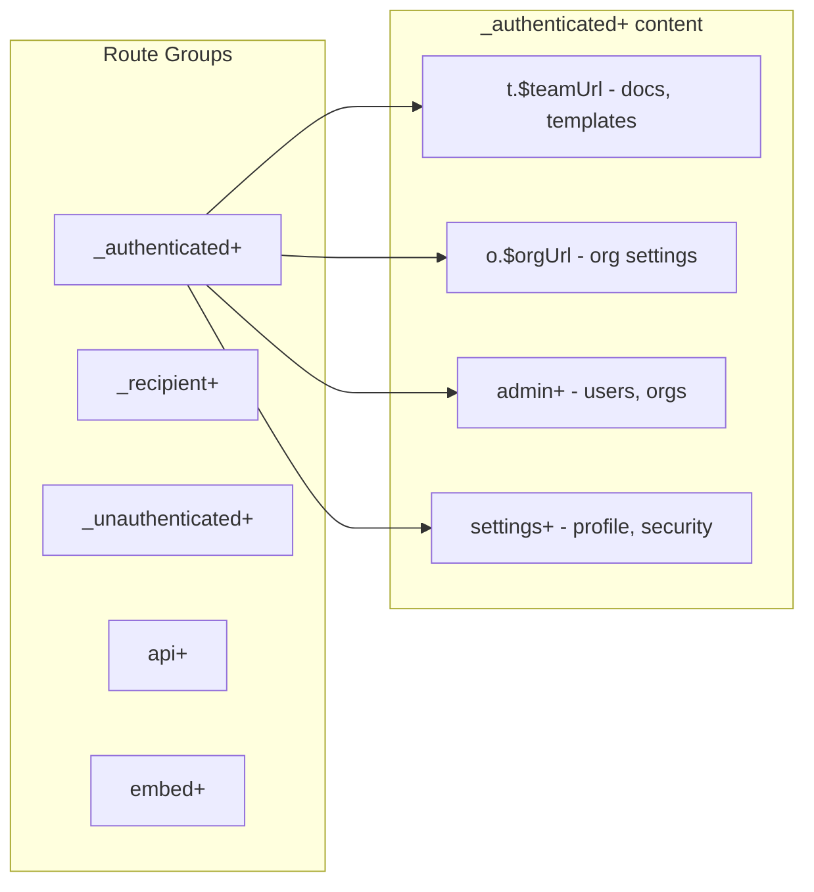
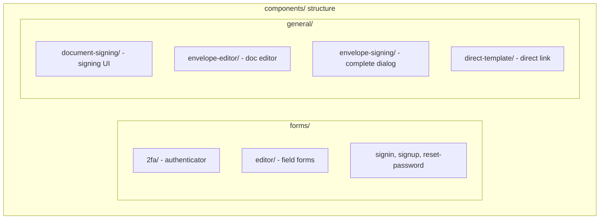

# Documenso Remix App Structure

## Route Groups Overview

| Prefix | Purpose |
|--------|---------|
| `_authenticated+` | Logged-in user: dashboard, teams, documents, templates |
| `_recipient+` | Document recipient: signing (`sign.$token`), download (`d.$token`) |
| `_unauthenticated+` | Auth flows: signin, signup, reset-password, verify-email |
| `_share+` | Public share pages |
| `_internal+` | Internal utilities (PDF, audit log) |
| `api+` | API endpoints |
| `embed+` | Embeddable signing/authoring (v0, v1) |

## Key Directories

- **components/dialogs/** - Modal dialogs (team, document, folder, webhook, etc.)
- **components/forms/editor/** - Field type forms for document editor (signature, text, date, etc.)
- **components/general/document-signing/** - Signing page UI (fields, auth, complete)
- **components/general/envelope-editor/** - Document/template editor (upload, fields)
- **server/api/** - File upload, download, presign endpoints
